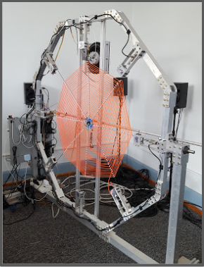

My name is Jillian Rix, and I'm currently an undergraduate student at Grinnell College majoring in Physics (but planning on also completing an undergraduate degree in Mechanical Engineering).

My research interests and experience have mainly been in the field of nonlinear and vibrational dynamics. However, I hope to apply those interests and skills to humanitarian and environmental engineering, particularly in the realm of energy efficiency research.

## Projects and Research

### Vibrational Dynamics of Orb-Webs
#### Oregon State University Robotics Department, Advisor Ross Hatton
The vibrational dynamics of spider webs play a key role in the way spiders hunt prey. By percieving vibrational signals propagated through the web with their legs, spiders are able to sense the distance they have to travel to reach their prey in the web, the prey's location, and the characteristic frequency. However, studying the vibrational dynamics of silk on a small scale is difficult because actual webs are hard to manipulate and to measure without inducing damage.  I worked in Ross Hatton's lab to construct large-scale, artificial spider webs with easiy manipulable properties to study the ways in which vibrations travel through an orb-web, and designed novel devices to allow for better manipulation of the web's initial conditions. Using accelerometers placed where a spider would contact the artificial web, vibrations that would be percieved by the spider can be better understood and therefore modeled. Ultimately, we hope to create a computational model of plane web dynamics easily accessible to those without a computational phsyics background, enabling biologists to better understand spider behavior.

### Stochastic Resonance in a Mechanical System
#### Grinnell College Physics Department, Advisor Barbara Breen
Stochastic resonance is a counterintuitive phenomenon whereby weak sinusoidal signals can be amplified by the presence of noise in certain nonlinear systems. Previous experiments have demonstrated stochastic resonance in electronic systems. However, we demonstrated stochastic resonance in a completely mechanical system for the first time, recruiting the noise of a flapping flag to amplify a weak oscillation imposed on an inverted pendulum in a bistable potential well. We were able to demonstrate mechanical stochastic resonance by showing that a particular non-zero amount of noise could be introduced to the nonlinear system to maximize detected signal strength. Mechanical stochastic resonance has numerous useful applications in the field of signal detection, and can be used to recruit apparently useless white noise.

## Publications

Breen, B. J., & Rix, J. G. (7 December 2016). Harvesting wind energy to detect weak signals using mechanical stochastic resonance. _Physical Review E_, 94. [DOI](https://journals.aps.org/pre/abstract/10.1103/PhysRevE.94.062205)

## Resume
